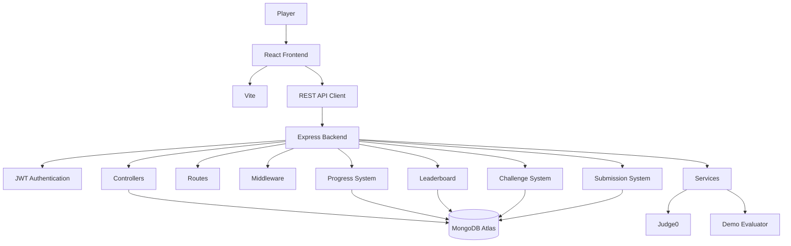

# ⚔️ DSA Quest

## Gamified Data Structures & Algorithms Learning Platform

<p align="center">

A full-stack gamified DSA learning platform that turns Data Structures and Algorithms practice into an interactive quest-based experience with XP, levels, streaks, coins, achievements, challenges, hints, submissions, profiles, world maps, and leaderboards.

</p>

<p align="center">


</p>

<p align="center">


</p>

---

# 🚀 Overview

**DSA Quest** is a full-stack learning platform designed to make Data Structures and Algorithms practice more engaging through game-inspired progression.

Instead of presenting DSA as a collection of disconnected coding questions, the platform organizes learning into a quest system.

Learners can explore different DSA worlds, solve coding challenges, earn XP and coins, maintain daily streaks, unlock achievements, view their progress, compare rankings, and continue their learning journey from a personalized dashboard.

The current Phase 1 implementation provides a production-style player dashboard together with authentication, challenge management, submissions, progress tracking, profiles, a world map, topic-based challenges, and leaderboard functionality.

---

# ✨ Features

## 🎮 Gamified Learning

- XP-based progression
- Player levels
- Daily streaks
- Coins
- Achievements
- Achievement progress
- Quest-based learning
- Daily challenges
- Continue Quest workflow
- Player profile
- Leaderboard

## 🧩 DSA Challenge System

The current learning world includes topics such as:

- Arrays
- Recursion
- Trees
- Sorting

Each challenge can contain:

- Title
- Description
- Difficulty
- Topic
- XP reward
- Test cases
- Keywords
- Hints
- Starter code
- Supported programming language

## 🗺️ World Map

The platform represents DSA topics as different learning zones:

```text
🏡 Array Village
🏰 Recursion Castle
🌲 Tree Forest
⚓ Sorting Harbor
```

Learners can explore topics and see their progress through each zone.

## 🏆 Achievements

The dashboard tracks achievement progress and unlocked badges.

Examples of achievement concepts include:

- Completing challenges
- Maintaining progress
- Reaching XP milestones
- Building consistency

## 🔥 Daily Streak

The player dashboard tracks daily learning activity.

The streak system encourages consistent practice instead of relying only on occasional intensive sessions.

## 🪙 Coins

Coins are part of the game progression system and can be used for gameplay features such as hints.

## 💡 Hint System

Challenges support hints that can help learners when they are stuck.

This creates a progression model where users can continue learning without immediately abandoning a difficult problem.

## 💻 Coding Challenges

Learners can write code for challenges and submit solutions.

The application supports programming languages including:

```text
JavaScript
Python
Java
C++
C
```

## 🧪 Code Evaluation

The backend supports Judge0 for real code execution.

When Judge0 is configured, challenge test cases are submitted to the configured Judge0 service with execution limits.

If Judge0 is not configured during development, the project uses a **demo evaluator** instead.

The demo evaluator does not execute arbitrary user code. It provides a safe development fallback based on challenge keywords.

## 📊 Submission Tracking

The platform records submission results such as:

- Accepted
- Wrong Answer
- Compilation Error
- Runtime Error
- Time Limit Exceeded

The dashboard also displays recent submission activity.

## 👤 Player Profile

The profile system provides information such as:

- Username
- XP
- Level
- Coins
- Streak
- Solved challenges
- Achievements
- Learning progress

## 🥇 Leaderboard

Players can compare their progress through leaderboard functionality.

This adds a competitive element to the learning experience while keeping the primary focus on DSA practice.

---

# 🖥️ Dashboard Preview

Add your actual screenshots to the repository when available.

Recommended structure:

```text
screenshots/
├── dashboard.png
├── challenge.png
├── world-map.png
├── leaderboard.png
└── profile.png
```

Then add them to this README:

```markdown
<p align="center">
  
</p>
```

> Do not reference screenshot files until they actually exist in the repository.

---

# 🏗️ System Architecture



---

# 🔄 Learning Flow

```text
User
 ↓
Login / Register
 ↓
Player Dashboard
 ↓
Explore World
 ↓
Select DSA Topic
 ↓
Select Challenge
 ↓
Read Problem
 ↓
Use Hint if Needed
 ↓
Write Code
 ↓
Submit Solution
 ↓
Evaluate Test Cases
 ↓
┌─────────────────────────────┐
│                             │
Accepted                   Failed
│                             │
↓                             ↓
XP + Coins                  Feedback
│                             │
↓                             │
Update Progress               │
↓                             │
Update Achievements           │
↓                             │
Update Leaderboard            │
↓                             │
Update Profile                │
└──────────────┬──────────────┘
               ↓
         Continue Quest
```

---

# 🎯 Progression System

The player experience is based around several progression metrics.

## XP

Players earn XP by completing challenges.

```text
Challenge
    ↓
Successful Submission
    ↓
XP Reward
    ↓
Player Progress
```

## Levels

XP contributes to player level progression.

The dashboard displays:

```text
Current Level
Current XP
XP in Current Level
XP Required for Next Level
Progress Bar
```

## Streak

Daily activity contributes to the player's learning streak.

## Coins

Coins provide an additional game-style progression resource.

## Achievements

Achievement progress provides long-term goals beyond individual challenges.

---

# 🧩 Supported DSA Topics

The current dashboard organizes the available challenges around:

| Topic | World |
|---|---|
| Arrays | 🏡 Array Village |
| Recursion | 🏰 Recursion Castle |
| Trees | 🌲 Tree Forest |
| Sorting | ⚓ Sorting Harbor |

The architecture is designed so additional DSA topics can be added later.

---

# 💻 Code Execution Architecture

## Production / Configured Mode

When Judge0 is configured:

```text
User Code
    ↓
Express Backend
    ↓
Challenge Test Cases
    ↓
Judge0
    ↓
Execution Result
    ↓
Submission Result
    ↓
Player Dashboard
```

The executor applies execution limits including:

```text
CPU Time Limit: 2 seconds
Wall Time Limit: 5 seconds
Memory Limit: 128 MB
```

## Development Mode

When Judge0 is not configured:

```text
User Code
    ↓
Demo Evaluator
    ↓
Challenge Keywords
    ↓
Demo Result
```

The demo evaluator is intentionally not an arbitrary code execution engine.

---

# 🛡️ Authentication & Security

The backend includes:

- JWT authentication
- Password hashing with bcryptjs
- Protected routes
- Authentication middleware
- Request validation
- Rate limiting
- Helmet security headers
- CORS configuration
- Centralized error handling

The server also separates authentication, controllers, models, routes, services, and utility logic.

---

# 🧠 Backend Design

The backend follows a modular architecture.

```text
Routes
  ↓
Authentication / Middleware
  ↓
Controllers
  ↓
Services
  ↓
Models
  ↓
MongoDB
```

This structure keeps business logic separated from API routing and database models.

---

# 🛠️ Technology Stack

## Frontend

| Technology | Purpose |
|---|---|
| React 18 | User interface |
| Vite 5 | Development and build tool |
| Lucide React | Icons |
| CSS | Responsive and game-inspired styling |

## Backend

| Technology | Purpose |
|---|---|
| Node.js | Backend runtime |
| Express.js | REST API framework |
| Mongoose | MongoDB ODM |
| JWT | Authentication |
| bcryptjs | Password hashing |
| Zod | Validation |
| Helmet | Security headers |
| express-rate-limit | Rate limiting |
| CORS | Cross-origin communication |
| dotenv | Environment configuration |

## Database

| Technology | Purpose |
|---|---|
| MongoDB | Application database |
| MongoDB Atlas | Cloud database deployment |
| Mongoose | Data modeling and persistence |

## Code Execution

| Technology | Purpose |
|---|---|
| Judge0 | Secure remote code execution |
| Demo Evaluator | Local development fallback |

---

# 📁 Project Structure

```text
dsa-quest-phase1-dashboard/
│
├── client/
│   ├── index.html
│   ├── package.json
│   ├── package-lock.json
│   ├── .env.example
│   │
│   └── src/
│       ├── main.jsx
│       ├── styles.css
│       │
│       ├── components/
│       │   ├── Auth.jsx
│       │   └── Layout.jsx
│       │
│       ├── lib/
│       │   └── api.js
│       │
│       └── pages/
│           ├── Challenge.jsx
│           ├── Dashboard.jsx
│           ├── Leaderboard.jsx
│           ├── Profile.jsx
│           ├── Topic.jsx
│           └── World.jsx
│
├── server/
│   ├── package.json
│   ├── package-lock.json
│   ├── .env.example
│   │
│   └── src/
│       ├── server.js
│       │
│       ├── config/
│       │   ├── db.js
│       │   └── env.js
│       │
│       ├── controllers/
│       │   ├── adminController.js
│       │   ├── authController.js
│       │   ├── challengeController.js
│       │   ├── dashboardController.js
│       │   ├── leaderboardController.js
│       │   ├── progressController.js
│       │   └── submissionController.js
│       │
│       ├── data/
│       │   ├── challenges.js
│       │   └── seed.js
│       │
│       ├── middleware/
│       │   ├── auth.js
│       │   └── error.js
│       │
│       ├── models/
│       │   ├── Challenge.js
│       │   ├── Submission.js
│       │   └── User.js
│       │
│       ├── routes/
│       │   ├── admin.js
│       │   ├── auth.js
│       │   ├── challenges.js
│       │   ├── dashboard.js
│       │   ├── leaderboard.js
│       │   ├── progress.js
│       │   └── submissions.js
│       │
│       ├── services/
│       │   ├── executor.js
│       │   └── store.js
│       │
│       └── utils/
│           └── auth.js
│
├── start-windows.bat
├── .gitignore
└── README.md
```

---

# ⚙️ Requirements

Install:

- Node.js
- npm
- MongoDB Atlas account or MongoDB instance
- Judge0 account/service for real code execution

Judge0 is optional for development because the project contains a demo evaluator.

---

# 🚀 Installation

## 1. Clone the Repository

```bash
git clone https://github.com/YOUR_USERNAME/dsa-quest-phase1-dashboard.git
```

Enter the project:

```powershell
cd dsa-quest-phase1-dashboard
```

---

# 📦 2. Install Backend Dependencies

```powershell
cd server
npm install
```

---

# 🔐 3. Configure Backend Environment

Create the environment file:

```powershell
copy .env.example .env
```

Configure:

```env
PORT=5001
MONGODB_URI=your_mongodb_connection_string
JWT_SECRET=your_long_random_secret
CLIENT_URL=http://localhost:5173

JUDGE0_URL=
JUDGE0_API_KEY=
JUDGE0_API_HOST=
```

For real code execution, configure the Judge0 variables.

Never commit the real `.env` file.

---

# 🗄️ 4. Seed the Database

From the `server` directory:

```powershell
npm run seed
```

This initializes the application's development data.

---

# ▶️ 5. Start the Backend

Development mode:

```powershell
npm run dev
```

The backend runs on:

```text
http://localhost:5001
```

---

# 🎨 6. Install Frontend Dependencies

Open another terminal:

```powershell
cd client
npm install
```

---

# 🔐 7. Configure Frontend

Create:

```text
client/.env
```

Use the frontend API configuration expected by:

```text
client/src/lib/api.js
```

Then start Vite:

```powershell
npm run dev
```

Open:

```text
http://localhost:5173
```

---

# 🧪 Demo Accounts

The project README provides development accounts:

### Demo User

```text
Email: demo@dsaquest.local
Password: Demo123!
```

### Admin User

```text
Email: admin@dsaquest.local
Password: Admin123!
```

Use development credentials only for local testing.

---

# 🔌 API Overview

The application includes REST APIs for:

## Authentication

```text
/api/auth
```

Used for registration, login, and authentication workflows.

## Dashboard

```http
GET /api/dashboard
```

Returns player dashboard information including:

- XP
- Level
- Streak
- Coins
- Solved challenges
- Achievements
- Recent submissions
- Daily challenge

## Profile

```http
GET /api/profile
```

Returns player profile and progress information.

## Daily Challenge

```http
GET /api/daily-challenge
```

Returns the current daily challenge.

## Challenges

```text
/api/challenges
```

Used for retrieving and working with DSA challenges.

## Submissions

```text
/api/submissions
```

Used for challenge solution submissions.

## Progress

```text
/api/progress
```

Used for tracking player learning progress.

## Leaderboard

```text
/api/leaderboard
```

Used for ranking and leaderboard information.

---

# 🧪 Testing Checklist

Before presenting the project, verify:

```text
✓ Frontend starts
✓ Backend starts
✓ MongoDB connection works
✓ Registration works
✓ Login works
✓ JWT authentication works
✓ Dashboard loads
✓ XP is displayed
✓ Level progression is displayed
✓ Streak is displayed
✓ Coins are displayed
✓ Achievements are displayed
✓ Daily challenge loads
✓ World map loads
✓ Topics load
✓ Challenges load
✓ Challenge editor works
✓ Hints work
✓ Submission flow works
✓ Demo evaluator works without Judge0
✓ Judge0 works when configured
✓ Profile loads
✓ Leaderboard loads
✓ Logout works
```

---

# 🔒 Environment & Git Security

Never commit:

```text
.env
node_modules/
dist/
coverage/
```

The repository uses `.env.example` files to document required configuration without exposing secrets.

For production deployments:

- Use a strong JWT secret
- Restrict CORS origins
- Use secure MongoDB credentials
- Enable HTTPS
- Configure Judge0 securely
- Do not expose API keys
- Review rate limits
- Validate all user input

---

# 📊 Product Vision

DSA Quest is designed around the idea:

```text
Learn
 ↓
Practice
 ↓
Solve
 ↓
Earn XP
 ↓
Level Up
 ↓
Unlock Achievements
 ↓
Build Streak
 ↓
Compete
 ↓
Master DSA
```

The goal is to make consistent DSA practice feel more like progressing through a game than completing a static question list.

---

# 🚀 Future Improvements

Potential future versions can add:

- 🧠 AI-powered hints
- 🤖 AI code review
- 📈 Personalized learning paths
- 🏆 Global leaderboard
- 👥 Multiplayer coding battles
- ⚔️ Real-time coding competitions
- 🧩 More DSA worlds
- 📝 More challenge categories
- 📊 Advanced performance analytics
- 🔥 Weekly and monthly quests
- 🎖️ More achievement types
- 💰 Expanded reward economy
- 🧪 Automated test-case generation
- 🌐 Social learning features
- 📱 Mobile application
- ☁️ Cloud deployment
- 🐳 Docker
- 🔄 CI/CD
- 🧪 Expanded automated testing

---

# 📚 Learning Outcomes

This project demonstrates practical experience with:

- Full-stack JavaScript development
- React
- Vite
- Node.js
- Express.js
- MongoDB
- Mongoose
- JWT authentication
- Password hashing
- REST API design
- Middleware
- Data modeling
- Game-inspired UX
- DSA challenge systems
- Code execution architecture
- Progress tracking
- Leaderboards
- Gamification
- Git and GitHub

---

# 🎯 Project Highlights

```text
React Frontend
      ↓
Gamified Player Experience
      ↓
Express REST API
      ↓
JWT Authentication
      ↓
Challenge & Progress Services
      ↓
MongoDB Atlas
      ↓
Submission Engine
      ↓
Judge0 / Demo Evaluator
      ↓
XP + Level + Achievements
      ↓
Leaderboard
```

---

# ⚠️ Code Execution Notice

When Judge0 is configured, submitted code is sent to the configured Judge0 service for execution.

The backend applies CPU, wall-time, and memory limits to Judge0 submissions.

When Judge0 is not configured, the project uses a safe demo evaluator.

The demo evaluator **does not execute arbitrary submitted code**.

For production use, review the complete execution infrastructure, isolation, quotas, rate limits, logging, and Judge0 configuration before allowing untrusted users to execute code.

---

# 👨‍💻 Author

## Pratik Fating

**MCA | Cybersecurity | Full-Stack Developer**

### Areas of Interest

- Data Structures & Algorithms
- Full-Stack Development
- Cybersecurity
- Python
- JavaScript
- React
- Backend Development
- Artificial Intelligence

---

# ⭐ Support

If you find DSA Quest useful or interesting, consider giving the repository a ⭐ on GitHub.

---

<p align="center">

⚔️ <strong>DSA Quest</strong>

<br>

<em>Learn. Solve. Level Up. 🚀</em>

</p>
